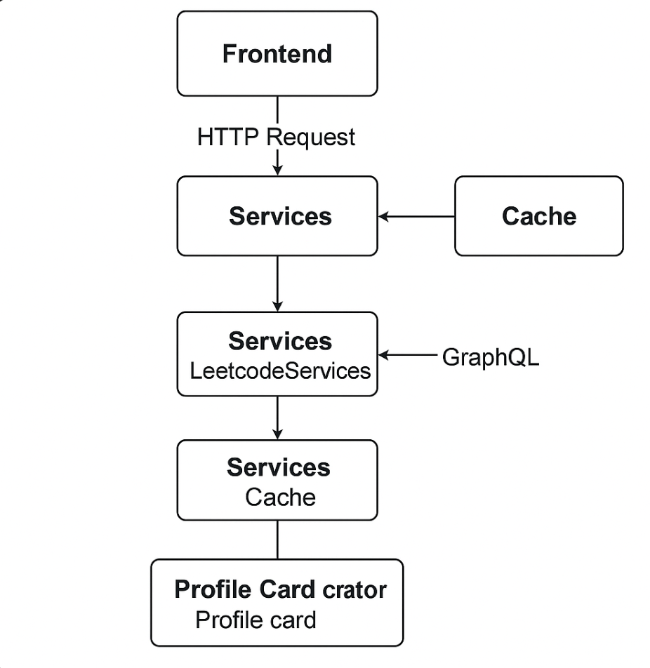
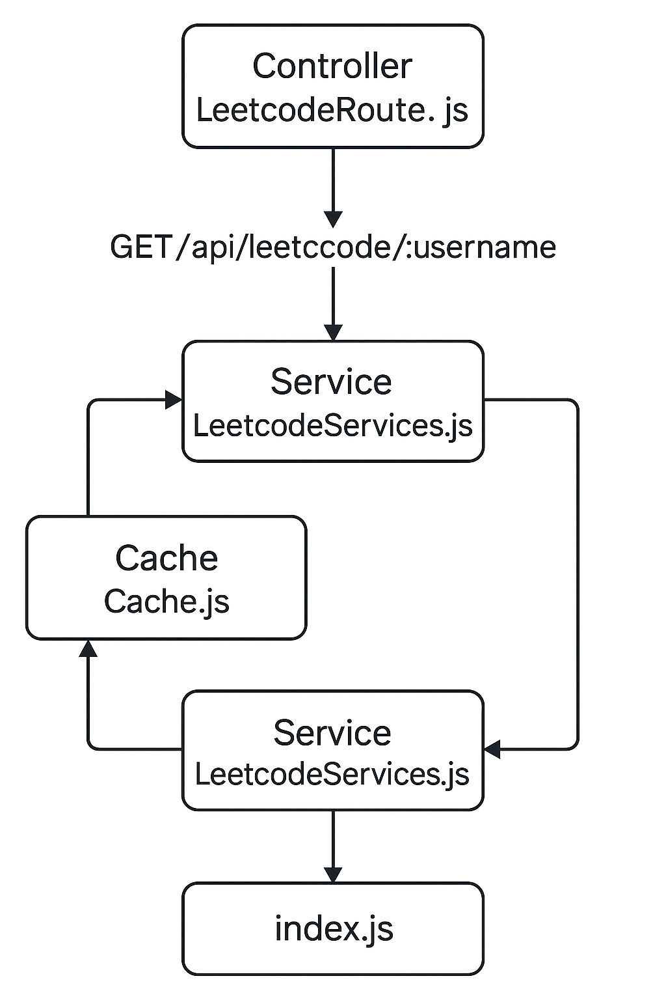
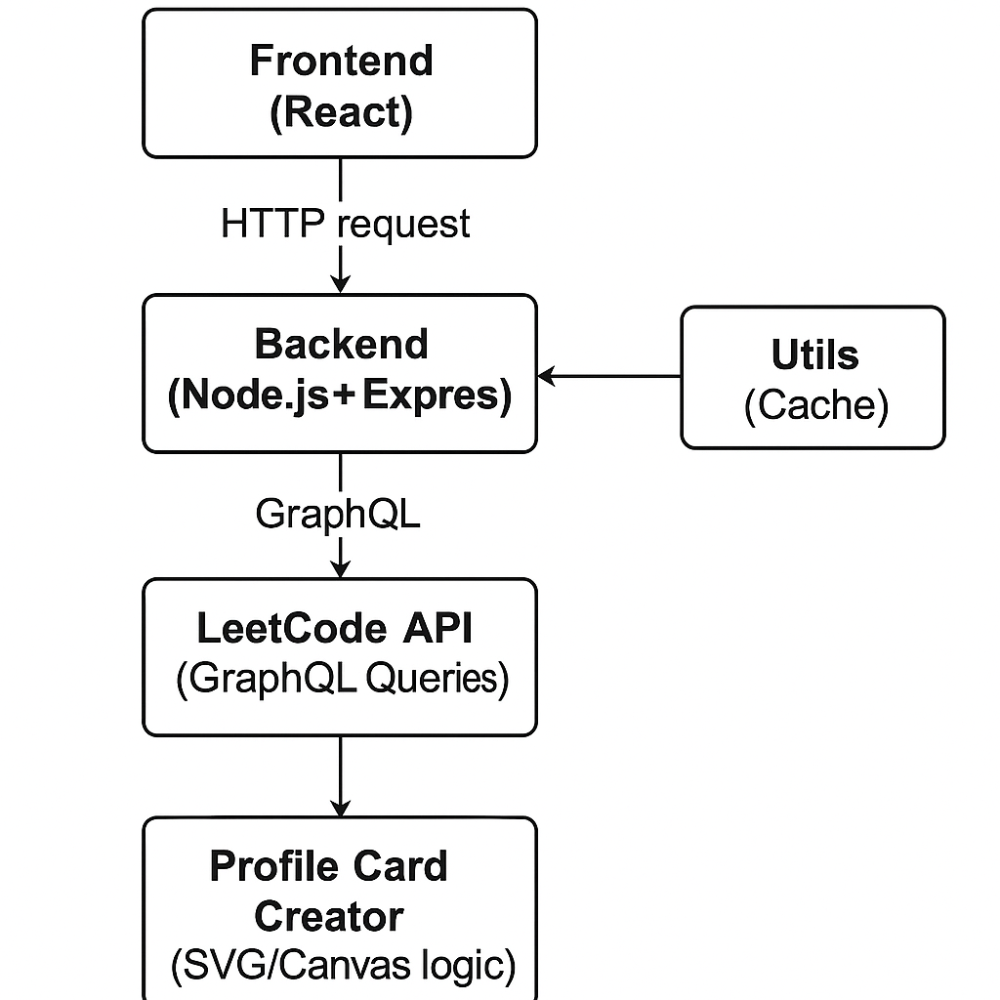

# LeetInsight - Leetcode Profile Card Generator (Backend)

**LeetInsight** is a web application that generates beautiful, shareable LeetCode profile cards using real-time stats. 

This repository contains the **Backend Service** that fetches user data from LeetCode via GraphQL, processes it, and returns it to the frontend with caching support.

## Features
- Express.js backend
- Fetches LeetCode stats via GraphQL
- In-memory caching for faster repeated requests
- Modular structure with clear separation of concerns

## System Design / Architecture
The system design diagram gives a full overview of how the entire backend flows — starting from the frontend request to the backend, interacting with the LeetCode API, using caching, and generating a profile card. It shows both internal and external interactions in one flow.



### Low Level Diagram (LLD)
The LLD diagram illustrates the internal structure of the backend — showing how different modules like `index.js`, `LeetcodeRoute`, `LeetcodeServices`, and `Cache` interact with each other. It represents the actual code-level flow and function responsibilities.




### High Level Diagram (HLD)
The HLD diagram presents a bird's-eye view of the system — highlighting how the frontend, backend, LeetCode GraphQL API, caching layer, and card generation module are structured and interact to deliver the LeetCode profile card feature.



## Get Started

1. Clone the repo
```bash
git clone https://github.com/AritraC1/LeetInsight-Backend.git
cd leetinsight-backend
```

2. Install dependencies
```bash
npm install
```

3. Run the server
```bash
npm start
```
